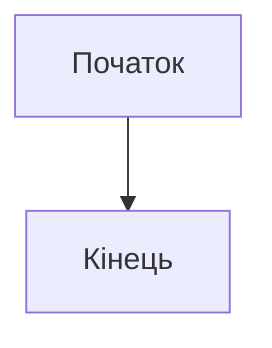

# lab-markdown
This repository was created to perform 3 laboratory works on the discipline of free choice

## Результати роботи

### 1. Опублікований HTML-звіт (GitHub Pages)

Звіт, згенерований з Markdown, опубліковано за допомогою GitHub Pages і доступний за посиланням:

**[https://gitCode5345.github.io/lab-markdown/](https://gitCode5345.github.io/lab-markdown/)**

### 2. Згенеровані файли

* [Звіт у форматі PDF (dist/report.pdf)](dist/report.pdf)
* [Звіт у форматі DOCX (dist/report.docx)](dist/report.docx)

### 3. Вихідний код звіту

* [docs/report.md](docs/report.md)

---

## Контрольні запитання та відповіді на них

**1. Що таке Markdown і для чого він використовується?**
Markdown — це легка мова розмітки, яка дозволяє форматувати звичайний текст за допомогою простих символів. Вона використовується для написання документації, файлів README (як цей), наукових статей, нотаток та постів у блогах, оскільки її легко писати та читати, і вона легко конвертується в HTML та інші формати.

**2. Які основні елементи форматування підтримує Markdown?**
Основні елементи:
* **Заголовки:** ( `# Заголовок 1`, `## Заголовок 2`)
* **Напівжирний** (`**text**`) та *курсивний* (`*text*`) текст.
* **Списки:** нумеровані (`1. Пункт`) та марковані (`* Пункт`).
* **Посилання:** `[текст](URL)`
* **Зображення:** ``
* **Цитати:** `> Цитата`
* **Код:** інлайн (`` `code` ``) та блочний (```` ``` ... ``` ````).
* **Таблиці**.

**3. Як у Markdown вставляються формули LaTeX? Наведіть приклади інлайн і блочної формули.**
Формули вставляються за допомогою синтаксису LaTeX:
* **Інлайн-формула:** оточується одним знаком долара (`$`). Приклад з вашої роботи: `$E = mc^2$`.
* **Блочна формула:** оточується подвійними знаками долара (`$$`). Приклад з вашої роботи: `$$a^2 + b^2 = c^2$$`.

**4. Що таке Mermaid і як додати просту діаграму у Markdown?**
**Mermaid** — це інструмент, який дозволяє створювати діаграми та графіки, описуючи їх текстом. Щоб додати діаграму, потрібно створити блок коду з типом `mermaid` і написати в ньому код діаграми, як ви зробили у своєму звіті.


**5. Як виконати конвертацію Markdown у формати HTML, DOCX і PDF за допомогою Pandoc?**

Для конвертації використовують інструмент **Pandoc** у терміналі:

```bash
pandoc docs/report.md -o dist/report.html --standalone
pandoc docs/report.md -o dist/report.docx
pandoc docs/report.md -o dist/report.pdf
```

Конвертація у PDF вимагає встановленого LaTeX.
Для коректної обробки діаграм потрібно додати фільтр:

```bash
--filter mermaid-filter
```

***6. Яка структура типового проєкту Markdown на GitHub?***

Типова структура проєкту на GitHub, що використовує Markdown, може виглядати так:

```bash
project-name/
├── README.md # Основний опис проєкту
├── docs/ # Додаткові документи (звіт, звітність, інструкції)
│ ├── report.md
│ ├── images/ # Зображення або діаграми, які вставляються у Markdown
│ └── diagrams/ # Файли з діаграмами (наприклад .mmd для Mermaid)
├── dist/ # Експортовані файли (HTML, DOCX, PDF)
├── src/ # Вихідний код (якщо проєкт містить програмні частини)
├── .gitignore # Файли, які не потрапляють у репозиторій
└── LICENSE # Ліцензія проєкту
```

**7. Як налаштувати GitHub Pages для публікації HTML-файлу?**

Щоб опублікувати HTML-версію звіту через **GitHub Pages**, виконайте такі кроки:

1. Перейдіть у налаштування репозиторію (**Settings → Pages**).  
2. У розділі **Build and deployment** виберіть:
   - **Source:** “Deploy from a branch”
   - **Branch:** `main` (або `master`)
   - **Folder:** `/dist` (де зберігається `index.html`)
3. Натисніть **Save**.  
4. Через кілька хвилин сайт буде доступний за адресою:  
https://"username".github.io/"repository-name"/
5. Якщо HTML-файл має іншу назву або знаходиться в іншій папці, оновіть шлях у налаштуваннях.

**8. У чому переваги зберігання документації у Markdown перед традиційними текстовими форматами?**

- **Простота** — Markdown легко читати навіть у звичайному текстовому вигляді, без спеціальних редакторів.  
- **Гнучкість** — його можна швидко конвертувати у HTML, PDF, DOCX та інші формати.  
- **Сумісність з GitHub** — файли `.md` автоматично відображаються з форматуванням у репозиторії.  
- **Контроль версій** — Markdown-файли легко відстежувати у Git, адже це звичайний текст.  
- **Кросплатформність** — не залежить від ОС чи програми, відкривається будь-де.  
- **Зручність для спільної роботи** — кілька користувачів можуть одночасно редагувати документацію.  

**9. Які проблеми можуть виникати при конвертації у PDF і як їх вирішити?**

Під час конвертації Markdown у PDF за допомогою **Pandoc** можуть виникати такі проблеми:

- **Відсутній LaTeX** — без встановленого LaTeX-дистрибутиву (наприклад, TeX Live або MikTeX) створити PDF неможливо.  
   *Рішення:* встановити LaTeX і перевірити, що команда `pdflatex` доступна у терміналі.  

- **Некоректне відображення зображень або діаграм** — шляхи до файлів можуть бути неправильними.  
   *Рішення:* використовувати відносні шляхи (наприклад, `./docs/images/diagram.png`) і додати фільтр `--filter mermaid-filter` для обробки діаграм.  

- **Проблеми зі шрифтами або кодуванням** — кирилиця чи спеціальні символи можуть відображатися некоректно.  
   *Рішення:* додати параметр `--pdf-engine=xelatex` або `--pdf-engine=lualatex`, які краще підтримують Unicode.  

- **Зміщення форматування або сторінок** — таблиці чи великі блоки коду можуть не поміщатися.  
   *Рішення:* використовувати параметри стилю (`--variable geometry:margin=1in`) або розділяти контент на менші частини.  

> Рекомендація: перед створенням PDF завжди перевіряйте HTML-версію, щоб переконатися, що структура документа правильна.

**10. Які вимоги до оформлення звіту згідно цієї лабораторної роботи?**

Звіт до лабораторної роботи №3 має бути виконаний у форматі Markdown і відповідати таким вимогам:

### Структура звіту
Файл звіту розміщується у каталозі `docs/` і має назву `report.md`.  
Рекомендована структура репозиторію:
```bash
docs/
├── report.md # основний файл звіту
├── sample_diagram.mmd # (опційно) окремий файл з Mermaid
dist/
├── report.html
├── report.docx
└── report.pdf
README.md
```

### Зміст файлу `report.md`
Документ повинен містити такі елементи:
1. **Заголовок** та короткий опис роботи (3–5 речень).  
2. **Список** ваших 5 улюблених книг (нумерований або маркірований).  
3. **Формули** — не менше трьох відомих математичних формул у форматі LaTeX (інлайн і блочні).  
4. **Діаграма** — створена за допомогою Mermaid або ASCII-графіки.  
5. **Таблиця** з переліком книг і кількістю сторінок.  
6. **Висновки** — короткий підсумок виконаної роботи (2–4 речення).

### Додаткові вимоги
- Усі результати конвертації (`report.html`, `report.docx`, `report.pdf`) мають бути збережені у папці `dist/`.  
- Конвертація виконується за допомогою команди **Pandoc**.  
- (Опційно) налаштувати **GitHub Pages** для публікації HTML-версії звіту.  
- У репозиторії обов’язково має бути файл `README.md`, який містить опис роботи та відповіді на контрольні запитання.
