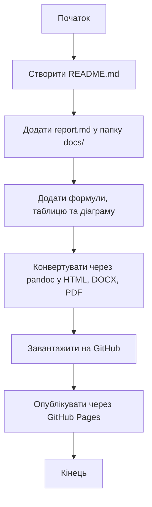

# Лабораторна робота №3

## Тема
Markdown — створення документа, діаграми та публікація на GitHub

## Мета роботи
Навчитися створювати структурований документ у Markdown, додавати списки, математичні формули, діаграми (Mermaid), конвертувати Markdown у HTML / DOCX / PDF і опублікувати результат на GitHub.

---

## 1. Короткий опис
Markdown — це проста й зручна мова розмітки, яка дозволяє швидко створювати структуровані документи, що зручно читаються у вихідному вигляді.  
Її активно використовують для написання документації, README-файлів, нотаток, технічних звітів та постів на GitHub.  
Markdown підтримує текстове форматування, списки, таблиці, формули, зображення й навіть діаграми через Mermaid.

---

## 2. Список моїх 5 улюблених книг
1. Джордж Орвелл — *1984*  
2. Дж. Р. Р. Толкін — *Володар перснів*  
3. Рей Бредбері — *451° за Фаренгейтом*  
4. Стівен Гокінг — *Коротка історія часу*  
5. Артур Конан Дойл — *Пригоди Шерлока Холмса*  

---

## 3. Відомі формули

**Інлайн-формула:**  
Енергія, що виникає внаслідок еквівалентності маси та енергії:  
$E = mc^2$

**Блочна формула 1 (Теорема Піфагора):**
$$
a^2 + b^2 = c^2
$$
Описує зв’язок між катетами і гіпотенузою у прямокутному трикутнику.

**Блочна формула 2 (Інтеграл Гауса):**
$$
f(x) = \int_{0}^{\infty} e^{-x^2} \, dx
$$
Використовується у теорії ймовірностей та статистиці при розрахунку нормального розподілу.

**Блочна формула 3 (Похідна степеневої функції):**
$$
\frac{d}{dx}(x^n) = nx^{n-1}
$$
Відображає правило диференціювання степеневих функцій.

---

## 4. Діаграма (Mermaid)

## 5. Таблиця книг
|  №  | Назва книги            | Автор            | Кількість сторінок |
| :-: | :--------------------- | :--------------- | :----------------: |
|  1  | 1984                   | Джордж Орвелл    |         328        |
|  2  | Володар перснів        | Дж. Р. Р. Толкін |        1178        |
|  3  | 451° за Фаренгейтом    | Рей Бредбері     |         256        |
|  4  | Коротка історія часу   | Стівен Гокінг    |         240        |
|  5  | Пригоди Шерлока Холмса | Артур Конан Дойл |         307        |

Висновки: Під час виконання лабораторної роботи я ознайомився з мовою розмітки Markdown і навчився створювати структуровані документи. Markdown дозволяє легко оформлювати текст, додавати формули, таблиці та діаграми. Також я дізнався, як конвертувати файли за допомогою Pandoc і публікувати їх через GitHub Pages. Отримані навички можна застосувати для створення технічної документації або навчальних матеріалів.
